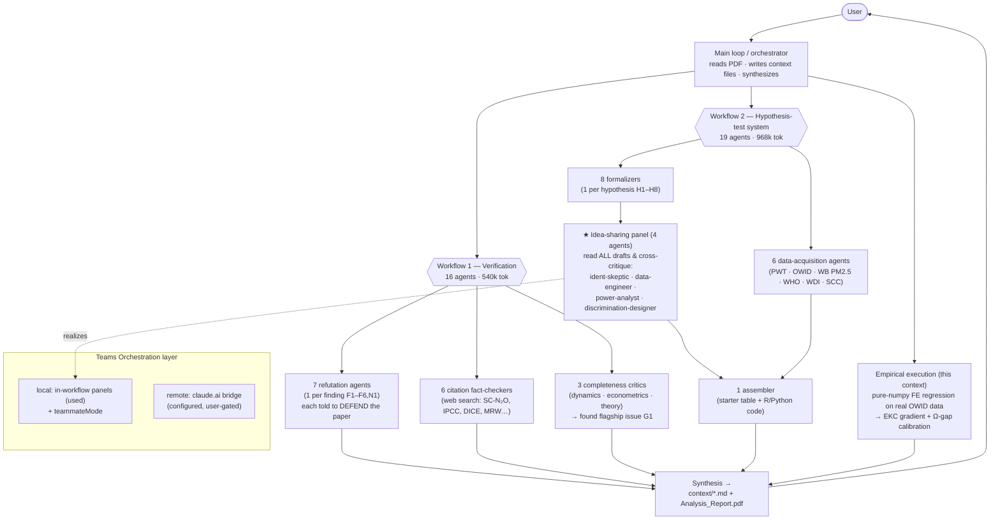

# Research_Analyzer — Adversarial Analysis of *Thermodynamic Waste, Health Capital, and Long-Run Growth*

This repository contains a complete, multi-agent **stress-test and empirical analysis** of
Stuart Greenlee's working paper *"Thermodynamic Waste, Health Capital, and Long-Run Growth:
A Thermo-Ecological Augmentation of the Solow Model"* (May 2026). It was produced with Claude
Code using large-scale agent orchestration. The research-ready write-up is
[`Analysis_Report.pdf`](Analysis_Report.pdf); the working notes are in [`context/`](context/);
the project guide is [`CLAUDE.md`](CLAUDE.md).

---

## 1. Claude Teams Orchestration & the security settings it requires

> **Read this first.** Parts of this analysis used multi-agent collaboration ("Claude Teams").
> One layer of it is **outward-facing** (it uploads a session mirror to claude.ai), so it has
> real privacy/security implications and a specific settings + consent model.

**"Claude Teams" / Teams Orchestration** is Claude Code's capability for multiple Claude agents
to collaborate. It comes in **three layers**, with increasing blast radius:

| Layer | What it is | Data exposure | Setting |
|-------|------------|---------------|---------|
| **In-workflow subagents** | The `Workflow` tool spawns many ephemeral agents that run in parallel/pipeline and **share intermediate results** (e.g. an "idea-sharing panel" where every agent reads all the others' drafts). | **Local only** — nothing leaves the machine | none (built-in) |
| **Teammates** | Persistent peer agent sessions (tmux / in-process) that can message each other via `SendMessage`. | **Local only** | `teammateMode` |
| **Remote Control / claude.ai Teams** | A bridge connecting the session to **claude.ai** so it can be driven from the web and peers on **other machines** can collaborate. | **Outward-facing — mirrors session state to claude.ai** (may be cached/indexed even if later deleted) | `remoteControlAtStartup` |

### Security settings necessary (this repo's [`.claude/settings.json`](.claude/settings.json))

```jsonc
{
  "teammateMode": "auto",          // local teammate execution (tmux/in-process). No upload.
  "remoteControlAtStartup": true,  // OUTWARD-FACING: starts the Remote Control bridge each
                                   // session and mirrors session state to claude.ai.
  "isolatePeerMachines": true,     // SAFETY: a teammate on another machine cannot message
                                   // this session without your explicit approval.
  "permissions": { "allow": [ /* scoped writes + web tools, see file */ ] },
  "hooks": { "SessionStart": [ /* loads the context/ files each session */ ] }
}
```

**The settings that matter, and why:**

- **`teammateMode: "auto"`** — enables local teammates to run and share ideas. Safe (no upload).
- **`remoteControlAtStartup: true`** — the **outward-facing** switch. It exposes the session to
  claude.ai. Turning it on is informed consent to external data sharing.
- **`isolatePeerMachines: true`** — the key **safety guard**: never auto-accept a cross-machine
  peer message; require approval. Keep this on whenever Remote Control is on.
- **`autoUploadSessions`** — *deliberately left OFF.* It would mirror **every** session to the
  web as view-only. Add it only if you want that.
- **Off switch:** set `"disableRemoteControl": true`, or delete the three keys.

### Important security behavior we hit (and you should expect)

Claude Code's **auto-mode safety classifier blocks an *agent* from enabling
`remoteControlAtStartup` itself** — even after you say "set it up." Enabling outward data
exposure is treated as the **user's** action: you must edit `settings.json` (or use the
in-session Remote Control toggle) by hand. That is by design and is a good guardrail. During this
project the agent's writes were denied twice; the user applied the change manually.

> **Bottom line:** the collaboration you see in the diagram below was done with **local,
> in-workflow agents** (no upload required). Remote Control / claude.ai Teams is an *optional*
> upgrade for live cross-machine peer sessions, gated behind explicit user consent.

---

## 2. The system of agents

Two large agent fleets were orchestrated (≈35 agents total, ≈1.5M tokens), plus a final
single-context empirical execution. The main loop (this session) orchestrated everything and
synthesized the deliverables.



<details><summary>ASCII fallback (same structure)</summary>

```
User
 └─ Main loop (orchestrator: read PDF, write context/, run analysis, synthesize)
     ├─ WORKFLOW 1 · Verification (16 agents)
     │    ├─ 7  refutation agents .... each DEFENDS the paper vs one finding → F1 confirmed, F6 refuted
     │    ├─ 6  citation checkers ..... web-verify SC-N₂O, IPCC, DICE, MRW, OECD, EPA
     │    └─ 3  completeness critics .. dynamics / econometrics / theory → found flagship G1
     ├─ WORKFLOW 2 · Hypothesis-test system (19 agents)
     │    ├─ 8  formalizers ............ one falsifiable spec per hypothesis (H1–H8)
     │    ├─ 4  IDEA-SHARING PANEL ..... read all drafts, cross-critique  ◄── the "Teams" collaboration
     │    ├─ 6  data-acquisition ....... PWT, OWID, WB PM2.5, WHO HALE, WDI, EPA SCC (verified)
     │    └─ 1  assembler .............. starter table + runnable R/Python
     └─ Empirical execution (this context): numpy FE regression on real OWID data
          → EKC decoupling gradient + Ω-gap calibration
   Teams layer:  local in-workflow panels (USED) + teammateMode  |  claude.ai Remote Control (user-gated)
```
</details>

---

## 3. The paper in one paragraph

It augments the Solow growth model with a multiplicative **thermo-ecological multiplier**
Ω = ϕ(τ)·ζ(H)·θ(H)^(1−α) ≤ 1, where τ is waste intensity (≈ CO₂/GDP) and **health capital H**
feeds *both* labor quality θ and TFP ζ. Because Ω multiplies output, it lands in the steady
state with an **amplified** exponent y\* ∝ (Ω\*)^(1/(1−α)), producing a **"thermodynamic growth
trap"** invisible to GDP. It nests standard Solow when Ω = 1, and proposes **Thermo-GDP** = GDP − D.

## 4. Findings (summary — full detail in [`context/`](context/))

- **Novelty ≈ 3/10 (math), 6/10 (synthesis).** The "amplification" is the textbook
  Solow/Mankiw–Romer–Weil level effect (web-verified); DICE already multiplies output by a
  damage factor `1 − 0.00236·T²` (web-verified), so "amplification absent from DICE" fails —
  though it survives vs Green Solow. The one genuinely novel idea: **ζ(H)** — pollution erodes
  cognition, so *measured* TFP can fall while knowledge rises.
- **Flagship structural issue (G1):** because τ = ‖TO‖/(p₀·**Y**) has output in the denominator,
  Ω is endogenous to Y — the "closed-form" steady state is actually **implicit** and the headline
  elasticity is a mislabeled partial derivative. *(Found by independent completeness critics; my
  first pass missed it.)*
- **Verification corrected the critique itself:** **F6 refuted** (the health loop is provably
  self-correcting → unique, stable equilibrium); **F2–F5 weakened**.
- **Two citation errors confirmed:** SC-N₂O ≈ **\$54,000/t** (paper says \$5,400, ~10× low);
  the "10–23% by 2100" damages figure is **Burke–Hsiang–Miguel 2015 / IPCC WGII**, mis-cited to
  WGIII.
- **Executed empirical test (real OWID data, 164 countries — [`context/results.md`](context/results.md)):**
  an **EKC gradient**. Rich economies **decouple** (waste intensity −2.5%/yr, falling in 70% of
  country-years) → the trap **dissolves** for them; poor economies **do not** (intensity flat,
  +0.04%/yr) → the trap **persists where the paper claimed a poverty trap**. The naive
  `dln(τ)~dln(Y)` test was mechanically `β−1` (confirming the endogeneity critique). The implied
  Ω-gap is **magnitude-indeterminate** (3%→40%+), which **corrected an over-claim in my own
  stress-test (F4)**.

## 5. Verdict

The paper is a **clean synthesis + one sharp testable hypothesis (ζ(H))**, not the structural
novelty it claims, and **not** a universal "growth trap." The honest, evidence-grounded reading:
a **real but parameter-sensitive drag that matters most for non-decoupling developing economies**.
No fatal errors; G1 is borderline and the closed-form results need re-derivation as a fixed point.

## 6. Repository map

| Path | What |
|------|------|
| [`Analysis_Report.pdf`](Analysis_Report.pdf) | Research-ready write-up (formatted like the source paper) |
| [`CLAUDE.md`](CLAUDE.md) | Project guide — dictates the `context/` files |
| [`context/paper-understanding.md`](context/paper-understanding.md) | Neutral reconstruction (no critique) |
| [`context/stress-test.md`](context/stress-test.md) | Critique + novelty (F1–F11, G1–G13), verification-checked |
| [`context/source-map.md`](context/source-map.md) | Citation audit |
| [`context/hypothesis-tests.md`](context/hypothesis-tests.md) | 8 falsifiable hypotheses + design-panel synthesis |
| [`context/data-sources.md`](context/data-sources.md) | Verified data inventory + starter dataset |
| [`context/results.md`](context/results.md) | **Executed** empirical results |
| [`context/analysis/`](context/analysis/) | Runnable code (`decoupling_h8.py` executed; `anchor_regression.{R,py}`) |

## 7. Reproduce the empirical test

```bash
python context/analysis/decoupling_h8.py   # downloads OWID, runs the FE decoupling test + calibration
```
*(Pure numpy; no pandas/statsmodels required. The two-way fixed-effects estimator and
cluster-robust SEs are implemented by hand.)*

---

*Generated with Claude Code (Anthropic). All findings cite specific equations/sections of the
source paper and, where empirical, real public data. This is an adversarial analysis — it is
designed to find weaknesses, and it reports what supports the paper as faithfully as what
undercuts it.*
